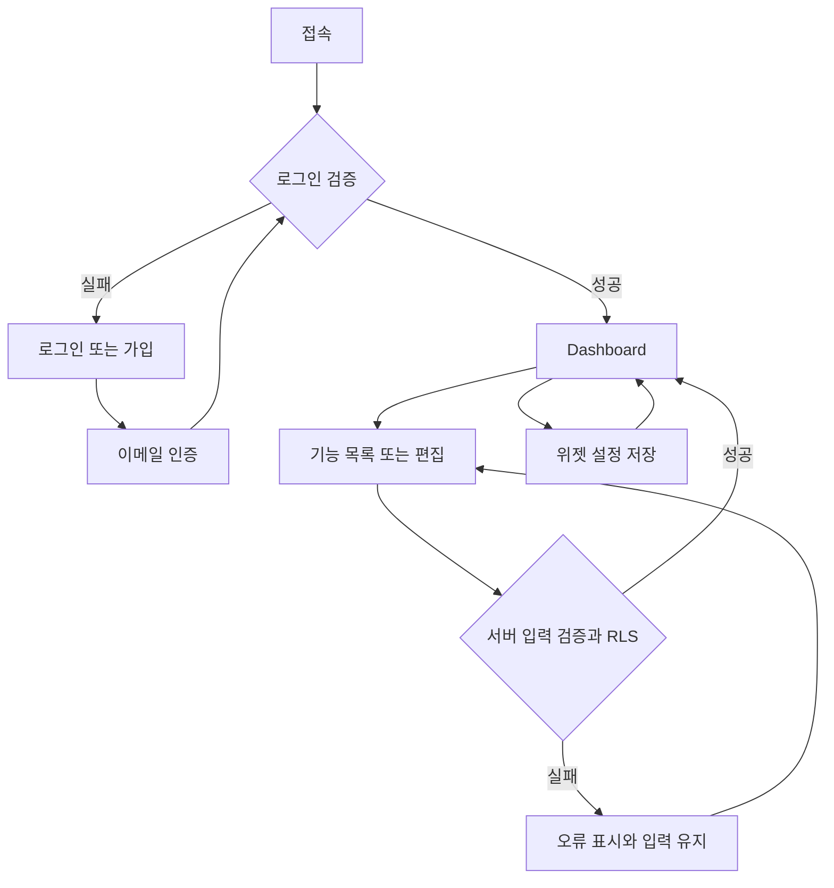
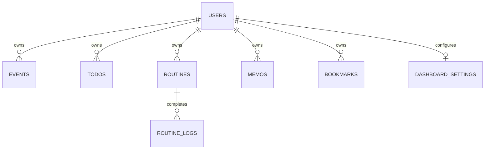

# 개인생활 대시보드 설계서

버전 1.0 · 2026-09-04 · 작업명 Daylog

이 문서는 코드 작성 전에 1~10단계를 순서대로 정의한 구현 기준이다. 결정 ID는 이후 코드와 변경 기록에서도 유지한다. 배포 대상은 Vercel이며, 실제 Supabase 프로젝트 생성·GitHub 연결·Vercel 배포는 계정 연결 후 진행한다.

## 1. 요구사항 정의

목표: 로그인한 사용자가 오늘 일정, 해야 할 일, 반복 습관, 메모, 자주 쓰는 링크를 한 화면에서 확인하고 수정한다. 개인용이지만 계정별 데이터 격리는 처음부터 적용한다.

| ID | 기능 | MVP 범위 / 완료 조건 |
|---|---|---|
| F01 | 인증 | 이메일·비밀번호 가입/로그인, 이메일 인증, 비밀번호 재설정, 로그아웃. 미인증 사용자는 개인 데이터에 접근 불가 |
| F02 | Dashboard | 오늘 일정, 미완료 Todo, 오늘 Routine, 최근 Memo, Bookmark 표시. 기능별 더보기와 추가 버튼 |
| F03 | 일정 | 제목·시작·종료·장소·설명 CRUD. 오늘과 겹치는 일정도 표시. 종일/반복 일정은 후속 |
| F04 | Todo | 제목·마감일(선택)·우선순위·완료 CRUD. 전체/미완료/완료 조회. 기한 경과 표시 |
| F05 | Routine | 제목·요일(복수)·시작일·활성 상태 CRUD. 당일 체크/취소. 같은 날 중복 완료 불가 |
| F06 | Memo | 제목·일반 텍스트 본문 CRUD, 최근 수정순. HTML/리치텍스트 제외 |
| F07 | Bookmark | 제목·HTTP(S) URL CRUD, 새 탭 열기 |
| F08 | 위젯 설정 | 표시/숨김, 위/아래 이동 후 일괄 저장. 계정별·기기 간 유지. 숨김은 데이터 삭제가 아님 |
| F09 | 반응형 | 모바일 1열, 중간 화면 2열, 넓은 화면 3열. 키보드 조작·명시적 레이블 |

공통: 입력 검증, 저장 중 중복 제출 방지, 오류 안내, 삭제 확인, 빈 상태, 새로고침, 서버에서 소유권 확인. 목록은 한 페이지 30개, 이전/다음 제공. Dashboard는 각 5개 미리보기(루틴은 오늘 대상 중 5개)와 전체 개수 표시.

| 결정 ID | 결정 | 이유 / 후속 영향 |
|---|---|---|
| D01 | Next.js App Router + React + TypeScript, Supabase, Vercel, GitHub | Spring Boot·별도 REST 서버·ORM 추가 안 함 |
| D02 | 한국어 UI, MVP 시간대 Asia/Seoul 고정 | 사용자별 시간대 설정은 후속. 일정은 UTC timestamptz, 마감일·완료일은 date |
| D03 | 이메일·비밀번호 인증 | Google 연동 승인 없이 시작. OAuth와 이메일 전송 연동은 별도 기능 |
| D04 | 독립된 도메인 테이블과 공통 위젯 틀 | 범용 content 테이블·EAV·동적 플러그인 로더 사용 안 함 |
| D05 | 루틴 정의와 완료 이력 분리 | 요일 변경에도 과거 완료 기록 보존. 루틴 삭제는 기록도 삭제 |
| D06 | 서버 조회 + Server Action 변경 + RLS | 모든 Action을 공개 엔드포인트로 간주, 인증/검증 매번 수행 |
| D07 | 위젯 키별 단일 인스턴스, 전체 설정 JSON 배열 1행 | 5개 설정을 원자적으로 저장. 좌표·사이즈·드래그 라이브러리는 제외 |
| D08 | 외부 연동은 확장 지점만 문서화 | 미사용 테이블, 큐, Redis, 범용 서비스 계층을 미리 만들지 않음 |
| D09 | 실데이터 화면에 샘플 자동 주입 금지 | 미연결 시 설정 안내. 인증 없는 가짜 로그인/성공 상태 없음 |
| D10 | 검증 실패·네트워크 오류는 사용자에게 알리고 기존 화면 유지 | 삭제/수정 실패를 성공처럼 표시하지 않음 |

범위 제외: 공유·협업, 첨부파일, 알림 발송, 달력 월간 UI, 일정 반복, Todo 하위 항목, 루틴 통계, 외부 연동, PWA. 기존 요구 변경 시 아래 변경 기록을 먼저 수정한다.

## 2. 화면 IA

| 경로 | 접근 | 화면 / 주요 행동 |
|---|---|---|
| `/` | 전체 | `/dashboard`로 이동 |
| `/login` | 전체 | 로그인, 가입 화면 연결 |
| `/signup` | 전체 | 계정 생성, 이메일 인증 안내 |
| `/forgot-password` | 전체 | 비밀번호 재설정 메일 요청 |
| `/auth/confirm` | 토큰 검증 | 가입/복구 토큰 검증 후 정해진 내부 경로 이동 |
| `/reset-password` | 인증 필요 | 새 비밀번호 저장 |
| `/dashboard` | 인증 필요 | 오늘의 요약, 5개 위젯 |
| `/schedule` | 인증 필요 | 일정 목록·추가·수정·삭제 |
| `/todos` | 인증 필요 | Todo 목록·필터·체크·CRUD |
| `/routines` | 인증 필요 | 반복 요일·활성 상태 관리·당일 체크 |
| `/memos` | 인증 필요 | 메모 목록·읽기·편집 |
| `/bookmarks` | 인증 필요 | 링크 관리 |
| `/settings` | 인증 필요 | 위젯 표시와 순서, 이메일·시간대 확인, 로그아웃 |
| `/setup` | 전체 | 환경변수 미설정 안내 |

넓은 화면은 왼쪽 탐색 메뉴, 모바일은 상단 가로 탐색 메뉴. 편집은 각 화면의 펼침 패널에서 수행해 별도의 복잡한 모달 상태를 없앤다.

## 3. Dashboard Wireframe

[배치도 SVG](dashboard-wireframe.svg) · [배치도 PNG](dashboard-wireframe.png). 배치도 내용은 설명용 예시이며 실제 사용자 데이터나 실행 화면 캡처가 아니다. 앱의 UI 문구는 한국어다.

표의 순서는 기본 배치이며 저장한 위젯 순서가 우선한다. wireframe은 콘텐츠 배치의 계약으로 최종 색상과 픽셀 수치는 구현에서 결정한다.

| 영역 | 넓은 화면 | 모바일 |
|---|---|---|
| 탐색 | 고정 너비 좌측 메뉴, Daylog 로고, 계정 | 로고와 가로 스크롤 탐색 |
| 상단 | 오늘 날짜, ‘오늘의 대시보드’, ‘위젯 설정’ | 제목 후 설정 버튼 |
| 요약 | 오늘 일정 수 / 미완료 Todo 수 / 오늘 Routine 완료율 | 줄바꿈 요약 |
| 1행 | 오늘 일정(1칸) / Todo(1칸) / Routine(1칸) | 일정 → Todo → Routine |
| 2행 | Memo(1칸) / Bookmark(1칸) | Memo → Bookmark |
| 카드 | 아이콘·제목·전체 개수·더보기, 최대 5개, 추가 버튼 | 동일 정보 |
| 상태 | 로딩 문구, 비어 있을 때 첫 항목 추가, 조회 실패 시 재시도 | 동일 |

시각 방향: 짙은 남색 탐색 메뉴와 흰색 작업 카드, 파란색 주요 행동, 얇은 경계선. 업무용 모니터링 화면보다 여유 있는 간격을 주되 첫 화면에서 실제 일정과 할 일을 확인하도록 한다. 배경 사진·마케팅 영역은 사용하지 않는다.

위젯 순서는 CSS grid의 DOM 순서와 일치한다. 모두 숨긴 경우 설정 복원 링크를 표시한다. 반응형에서 순서를 재정의하지 않는다.

## 4. 사용자 Flow

1. 가입: 이메일/비밀번호 입력 → Supabase 가입 → 인증 메일 → 토큰 검증 → Dashboard. 인증 실패 시 다시 로그인/가입 안내.
2. 매일 사용: 오늘 일정 확인 → Todo 완료 → Routine 체크 → 필요시 Memo/Bookmark 작성.
3. CRUD: 목록에서 새 항목 또는 수정 → 필드 입력 → 서버 검증/저장 → 패널 닫기·목록 갱신. 실패 시 패널 유지.
4. 삭제: 삭제 버튼 → 브라우저 확인 대화상자 → 본인 행 삭제 → 갱신. Routine 삭제 시 이력 삭제 안내.
5. 루틴: 서울 날짜·요일·시작일로 오늘 대상 판별 → 복합 키 upsert → 취소는 해당 날짜 행 삭제. 날짜 변경은 조회/변경 요청마다 서버에서 계산하고, 열린 화면도 자정 후 갱신한다.
6. 위젯: 표시 토글/위아래 이동 → 저장 1회 → Dashboard 동일 순서. 저장 전 변경은 서버에 반영되지 않음.
7. 복구: 재설정 메일 → recovery 토큰 검증 → 새 비밀번호 → Dashboard.

## 5. Supabase DB Schema

모든 사용자 데이터는 `public` 스키마. UUID 기본값 `gen_random_uuid()`. `user_id`는 `auth.users(id)` 참조, 계정 삭제 시 cascade. `created_at/updated_at`은 timestamptz. 수정 시 DB 트리거가 updated_at 갱신.

| 테이블 | 주요 컬럼 | 제약 / 인덱스 |
|---|---|---|
| `events` | id, user_id, title, starts_at, ends_at, location, description, timestamps | ends_at > starts_at; (user_id, starts_at), (user_id, ends_at) |
| `todos` | id, user_id, title, due_date nullable, priority low/medium/high, completed, timestamps | (user_id, completed, due_date) |
| `routines` | id, user_id, title, weekdays smallint[], starts_on, active, timestamps | weekdays는 0(일)~6(토), 1~7개·중복 불가; UNIQUE(id,user_id) |
| `routine_logs` | routine_id, user_id, completed_on, created_at | PK(routine_id,completed_on), FK(routine_id,user_id) → routines; (user_id,completed_on) |
| `memos` | id, user_id, title, body, timestamps | (user_id, updated_at DESC) |
| `bookmarks` | id, user_id, title, url, timestamps | URL http/https; (user_id,created_at DESC) |
| `dashboard_settings` | user_id PK, widgets jsonb, updated_at | 5개 키 모두 1회, 각 {key,visible}; 배열 순서가 표시 순서 |

문자 길이: 제목 1~120자(공백만 불가), 메모 20,000자, 설명 2,000자, 장소 200자, URL 2,048자. DB와 서버에서 동일하게 검증한다.

기본 위젯 키: `schedule`, `todos`, `routines`, `memos`, `bookmarks`. 설정 행이 없으면 기본 순서를 사용하고 최초 저장에서 upsert한다. 추가 프로필 테이블 없이 이메일은 Auth에서 얻는다.

일정의 오늘 포함 조건은 `starts_at < next_day_start AND ends_at > day_start`. 서울 00시를 UTC로 변환해 반열린 구간으로 조회한다. Todo 마감일은 시간대 변환 없는 날짜, Routine 완료일도 서울 달력 날짜다. 루틴 요일/시작일 변경은 앞으로의 대상 판단에만 적용하며 기존 로그를 덮어쓰지 않는다. 일괄 완료나 과거 날짜 입력은 MVP에서 제공하지 않는다.

정확한 실행 DDL은 `supabase/migrations/001_initial.sql`에 구현한다. 수동 테이블 수정 대신 번호가 증가하는 migration을 추가한다.

## 6. RLS 권한 설계

| 대상 | SELECT | INSERT | UPDATE | DELETE |
|---|---|---|---|---|
| 모든 사용자 테이블 | auth.uid() = user_id | WITH CHECK 동일 | USING와 WITH CHECK 모두 동일 | USING 동일 |
| routine_logs 추가 규칙 | 본인 기록 | 본인 루틴 + 오늘 + 활성 + 해당 요일 | 본인 소유·날짜만 유지하도록 동일 검사 | 본인 기록 |
| anon | 불가 | 불가 | 불가 | 불가 |

모든 테이블 ENABLE ROW LEVEL SECURITY. authenticated 역할에 필요한 CRUD 권한만 부여하고 anon은 제거. user_id는 서버 인증 결과로 설정하며 요청 값은 받지 않는다. 루틴 로그 복합 FK로 다른 사용자의 루틴에 본인 user_id를 붙이는 공격도 차단한다.

Server Action은 로그인 확인 후 UUID·본문 검증, ID와 user_id 조건으로 변경한다. 영향 행이 없으면 ‘항목이 없거나 접근할 수 없음’ 오류. 서비스 역할 키는 앱에서 사용하지 않으며 `.env.local`은 Git 제외. 단순 메뉴 숨김이나 proxy만으로 권한을 보장하지 않는다.

검증 시나리오: 비로그인 조회/쓰기 차단, A의 데이터를 B가 조회/수정/삭제 불가, user_id 변경 불가, B 루틴에 A 로그 추가 불가, 위젯 설정 다른 계정 변경 불가. SQL 테스트를 제공하고 실제 Supabase 연결 후 실행한다.

## 7. Next.js 프로젝트 구조

| 위치 | 책임 |
|---|---|
| `src/app/(auth)/` | 로그인·가입·비밀번호 복구 |
| `src/app/(dashboard)/layout.tsx` | 인증 확인과 공통 탐색 셸 |
| `src/app/(dashboard)/dashboard/` | Dashboard 서버 조회와 위젯 조립 |
| `src/app/(dashboard)/[section]/` | 허용 목록 기반 5개 도메인 목록 화면 |
| `src/app/(dashboard)/settings/` | 설정 화면 |
| `src/app/actions/` | 인증·도메인·설정 변경 |
| `src/app/auth/confirm/route.ts` | 이메일 토큰 확인 |
| `src/components/` | 셸, 위젯 카드, 편집 폼, 목록, 상태 |
| `src/lib/supabase/` | 서버 클라이언트·환경 설정 |
| `src/lib/` | 도메인 타입, 검증, 날짜 계산, 조회 함수, 위젯 목록 |
| `src/proxy.ts` | 세션 쿠키 갱신 |
| `supabase/migrations/` | DB DDL·RLS·트리거 |
| `tests/` | 날짜/검증·설정 및 SQL 권한 테스트 |
| `docs/` | 설계·결정/변경·검증 기록 |

Server Component를 기본으로 하고 입력/체크/순서 조정 부분만 Client Component. Zustand, Redux, React Query, repository 인터페이스는 도입하지 않는다. 여러 도메인의 공통 저장 진입점은 명시적 switch로 분기해 임의 테이블 접근을 막는다.

## 8. Component 설계

| 컴포넌트 | 구분 | 책임 |
|---|---|---|
| `AppShell` | Server | 메뉴·계정·공통 너비 |
| `DashboardPage` | Server | 병렬 조회, 요약, 저장한 위젯 순서 적용 |
| `WidgetCard` | Server | 제목·개수·더보기·빈 상태 |
| `ItemList` | Client | 도메인별 항목 표시, 완료·수정·삭제 |
| `ItemEditor` | Client | 기능별 필드, 서버 오류·저장 상태 |
| `WidgetSettings` | Client | 표시 토글, 키보드 가능한 순서 이동, 일괄 저장 |
| `AuthForm` | Client | 로그인/가입/복구/비밀번호 변경 |
| `error.tsx / loading.tsx` | Next 경계 | 조회 오류와 로딩 |

위젯 등록 목록은 key/label/path만 가진 정적 배열이다. 동적 import, 이벤트 버스, DI 컨테이너는 없다. 새로운 위젯 추가 시 타입·등록 목록·Dashboard 조회/렌더·설정 검증 migration만 변경한다. 미구현 위젯 카드로 화면을 채우지 않는다.

## 9. API / Server Action 설계

기본 조회는 서버 함수에서 Supabase query. 자체 REST API를 중복해서 만들지 않는다. 외부 callback은 Route Handler.

| 함수 | 입력 | 처리 / 결과 |
|---|---|---|
| `authenticate` | mode + FormData | 로그인/가입/복구/비밀번호 변경, 성공 시 이동 또는 안내 |
| `signOut` | 없음 | 세션 종료 → 로그인 |
| `saveItem` | section, id 선택, FormData | 허용 section 검증 → 도메인별 검증 → insert/update |
| `deleteItem` | section, UUID | 소유 행 delete, 없으면 오류 |
| `setTodoCompleted` | UUID, boolean | 소유 Todo 완료 값 명시적 set, 재호출 안전 |
| `setRoutineCompleted` | UUID, boolean | 서울 오늘 기준 upsert/delete, 중복 완료 없음 |
| `saveWidgetSettings` | 5개 설정 배열 | 전체 검증 → 1행 upsert, 원자적 적용 |
| `loadDashboard` | 인증 사용자 | 오늘 데이터/미리보기/개수 병렬 조회 |
| `loadSection` | 허용 section, page, filter | 소유 데이터 30개, 안정적 id 보조 정렬, count |
| `GET /auth/confirm` | token_hash, 허용 type | verifyOtp → 가입은 Dashboard, 복구는 reset-password. 임의 외부 redirect 없음 |

변경 결과는 `{ok:true}` 또는 `{ok:false,error:string}`. 사용자에게 DB 원문 오류·내부 키·토큰을 노출하지 않는다. 성공 후 관련 경로를 revalidate하고 클라이언트 refresh. 조회 오류는 error boundary로 보내 ‘빈 데이터’로 위장하지 않는다. 사용자별 응답은 동적 렌더링, 공유 캐시 사용 안 함.

외부 확장: Google Calendar/Gmail은 별도 OAuth scope·callback·연동 계정 테이블을 추가하고 토큰은 서버 전용 보관. Calendar는 `(user_id, provider, external_id)` 고유 키로 중복 동기화 방지. Weather는 위치 설정과 서버 캐시, Expense는 독립 테이블, AI Briefing은 사용자 데이터 범위를 명시한 서버 작업, Monthly Report는 집계와 작업 이력, PWA는 manifest/service worker와 인증 데이터 캐시 정책을 별도 도입한다. 실제 필요 전에는 구현하지 않는다.

## 10. MVP 개발 계획

| 순서 | 작업 | 종료 기준 |
|---|---|---|
| P1 | 앱 기반·migration·RLS | 스키마 적용 가능, 환경변수 샘플, 보안 테스트 준비 |
| P2 | Auth·공통 셸 | 이메일 로그인/가입/복구 코드, 보호 경로·로그아웃 |
| P3 | 일정·Todo | 검증·CRUD·오늘 조회·완료 상태 |
| P4 | Routine | 요일 관리·날짜별 멱등 체크 |
| P5 | Memo·Bookmark | CRUD·URL 검증·텍스트 렌더 |
| P6 | Dashboard·위젯 설정·반응형 | 5개 카드·개수·순서/숨김·모바일 레이아웃 |
| P7 | 검증·배포 준비 | 타입·프로덕션 빌드·핵심 자동 테스트, 계정 연결 절차 |
| P8 | 실서비스 연결 | Supabase migration/메일 템플릿, A/B RLS 테스트, GitHub push, Vercel 환경변수/배포, 실제 로그인 확인 |

개발 일정은 숙련도와 계정 설정에 따라 달라지므로 날짜를 확정하지 않는다. P1~P7은 로컬 소스 제공 범위, P8은 사용자 소유 계정 연결이 필요하다. UI 코드를 완성해도 실제 Auth·DB 검증이나 배포가 완료된 것으로 간주하지 않는다.

## 결정 변경 기록

| 버전 | 결정 | 변경 이유 | 영향 |
|---|---|---|---|
| 1.0 | D01~D10 최초 정의 | 사용자 요구의 구현 기준 고정 | 전체 |
| 1.0 구현 보완 | D06 유지, 요청 범위 인증 조회 재사용 | 같은 서버 렌더에서 중복 Auth 네트워크 요청 방지 | `requireUser`를 React cache로 감쌈. 요청 간 공유 캐시가 아니며 각 Action은 인증 확인 유지 |

변경 시 기존 결정을 삭제하지 말고 여기와 해당 단계에 새 버전·사유·영향 파일·검증 항목을 기록한다.

## 기술 근거

- Supabase SSR 공식 문서: https://supabase.com/docs/guides/auth/server-side/creating-a-client?queryGroups=framework&framework=nextjs — 서버 쿠키 클라이언트와 세션 갱신, 검증된 인증 정보 사용.
- Next.js Data Security: https://nextjs.org/docs/app/guides/data-security — 서버 경계에서 인증과 입력 검증.
- 확인일 2026-09-04. 이 문서의 기능 범위와 테이블 구성은 본 프로젝트 설계 결정이다.
